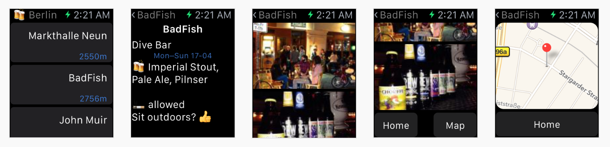

# Brew

The Brew app helps find pubs which have craft beer on the menu, be it in kegs or in bottles. Ales, IPAs, double IPAs, porters, stouts – from 4% to 12%, it's all here. Simply put, Brew is like Foursquare for craft beer places.

Currently available in Berlin, San Francisco and New York. [Download it][3] from the App Store.



Example which demonstrates using the [Contentful][1] SDK for bringing content to the ᴡᴀᴛᴄʜ.

[Contentful][1] is a content management platform for web applications, mobile apps and connected devices. It allows you to create, edit & manage content in the cloud and publish it anywhere via powerful API. Contentful offers tools for managing editorial teams and enabling cooperation between organizations.

## Usage

The example uses [CocoaPods][2] to integrate the SDK, so please run

```
$ pod install
```

before building it and use the Xcode workspace.

## License

Copyright (c) 2014-2015 Contentful GmbH. See LICENSE for further details.


[1]: https://www.contentful.com
[2]: http://www.cocoapods.org
[3]: https://itunes.apple.com/app/id986830433
